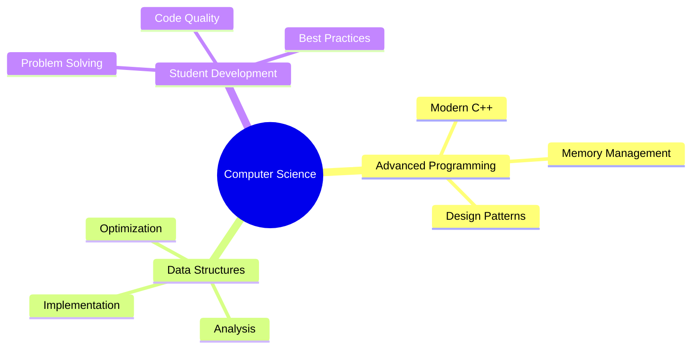

### Technical Stack

### GitHub Analytics

|  |  |
| ------------- | ------------- |

### Teaching Focus

```mermaid
mindmap
  root((Computer Science))
    Advanced Programming
      Modern C++
      Memory Management
      Design Patterns
    Data Structures
      Implementation
      Analysis
      Optimization
    Student Development
      Problem Solving
      Code Quality
      Best Practices
```

---

 

---

